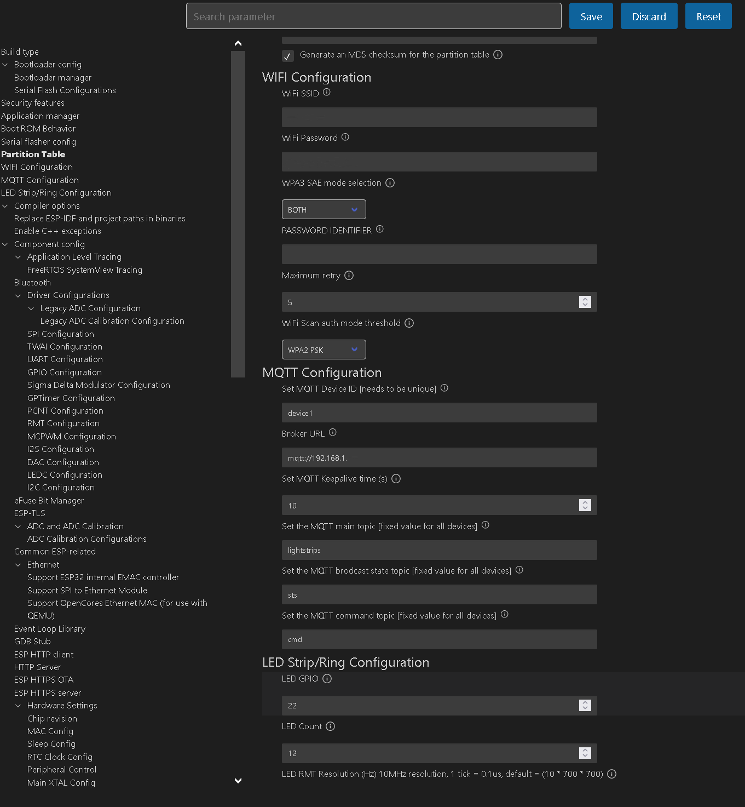

# ESP32 LED Strip MQTT Client

## Overview
This project is an MQTT client for controlling individually addressable LEDs like the WS2812 or SK6812 using an ESP32. 
It is designed to be used with a GUI controller application available at [mqtt-led-controller-ui](https://github.com/GitSoks/mqtt-led-controller-ui) which provides a user-friendly interface for sending color to multiple MQTT led controller clients.

The ESP32 board is programmed to connect to a WiFi network and then to a MQTT broker. It subscribes to a specific topic on the broker. When a message is received on this topic, the ESP32 board interprets the message as a command to change the color of the LED strip and reports the new color to the MQTT broker. All Messages are sent and received in JSON format.

## Table of Contents
- [Overview](#overview)
- [Table of Contents](#table-of-contents)
- [Getting Started](#getting-started)
  - [Prerequisites](#prerequisites)
  - [Using Github Codespaces with ESP-IDF (Optional)](#using-github-codespaces-with-esp-idf-optional)
  - [Installation](#installation)
- [Configuration](#configuration)
- [Usage](#usage)
- [GUI Controller](#gui-controller)
  - [Using the GUI Controller](#using-the-gui-controller)
- [Components & Libraries](#components--libraries)
- [Contact](#contact)
- [Acknowledgments](#acknowledgments)


## Getting Started

### Prerequisites
- An ESP32 development board
- A WS2812 or SK6812 LED strip
- A MQTT broker
- A WiFi network

### Option 1: Using Github Codespaces
This project can be run in a Github Codespace with an already configured ESP-IDF Deveelopment Environment where you can build and flash the firmware to your ESP32 board directly from the browser. This is a great option if you don't want to install ESP-IDF on your local machine. To use this option, you need to have a Github account and a Github Codespaces subscription.

To do so, follow these steps:
1. Create a Github Codespace using the `main` branch of this repository.
2. Install [ESP Updater](https://marketplace.visualstudio.com/items?itemName=masuidrive.vsc-esp-updater) extension from the VS Code Marketplace.
4. Run the `idf.py menuconfig` command to configure the project. See the [Configuration](#configuration) section for more details.
5. Run the `idf.py build` command to build the project.
6. Press `Ctrl+Shift+P` to open the command palette and run `Start ESP Updater on Browser` to upload the firmware to the ESP32 board from the browser.


### Option 2: Local Installation
1. Make sure that you have installed the [ESP-IDF](https://docs.espressif.com/projects/esp-idf/en/latest/esp32/get-started/index.html) development framework.
2. Clone this repository to your local machine using `git clone htttps://github.com/GitSoks/esp32-led-strip-mqtt-client.git`.
3. Navigate to the project directory.
4. Run the `idf.py menuconfig` command to configure the project. See the [Configuration](#configuration) section for more details.
5. Run the `idf.py build` command to build the project.
6. Flash the firmware to your ESP32 board using the `idf.py flash` command.


## Configuration
The following configuration project specific options are **important** and have to be configured before building the project:

- WiFi SSID and password
- MQTT broker URL (optional: port, username, and password)
- Device ID (used as MQTT client ID and needs to be unique for each device!)
- LED strip type (WS2812, SK6812)
- LED strip GPIO pin
- Number of LEDs connected

To configure the project, run the `idf.py menuconfig` command in the project directory. This will open a configuration menu where you can set the project options. For more information about the configuration menu, refer to the [ESP-IDF Programming Guide](https://docs.espressif.com/projects/esp-idf/en/latest/esp32/api-reference/kconfig.html?highlight=menu).



<p align="right">(<a href="#readme-top">back to top</a>)</p>

## Usage

This project was build to be used with the [GUI Controller](#gui-controller) shown below. However, it can also be used with any other MQTT client.

The MQTT client subscribes to the `MQTT_TOPIC_MAIN` topic defined in `main/mqtt_handler.c`. When a message is received on this topic, the LED strip controller changes the color of the LED strip accordingly.

To use the project, power on the ESP32 board and connect it to the same network as the MQTT broker. Send a message to the `MQTT_TOPIC_MAIN/DEVICE_ID/cmd` topic with the desired color. 
The state of the LED strip is published to the `MQTT_TOPIC_MAIN/DEVICE_ID/state` topic.

The message is expected to be in the following format JSON format for both the command and the state topics. The `device-id` field is used to identify the device and must be unique for each device. The `lights` field contains the color of each LED in the LED strip. The keys of the `lights` object are the LED indices and the values are objects containing the red, green, and blue values of the LED. The LED indices start at 0 and end at the number of LEDs minus 1.

The following message will set the color of led 0 to white, led 1 to blue, and led 10 to green.
```
{
  "device-id": "my-device",
  "lights": {
    "0": {
      "red": 255,
      "green": 255,
      "blue": 255
    },
    "10": {
      "red": 0,
      "green": 255,
      "blue": 0
    },
    ...
    "1": {
      "red": 0,
      "green": 0,
      "blue": 255
    }
  }
}
````

For debugging and testing purposes, I recommend using [MQTT Explorer](https://mqtt-explorer.com/) to send messages to the MQTT broker. This tool allows you to easily send messages to the broker and to monitor the messages received by the broker.

<p align="right">(<a href="#readme-top">back to top</a>)</p>

## GUI Controller

This project can be controlled using a GUI application available at [mqtt-led-controller-ui](https://github.com/GitSoks/mqtt-led-controller-ui). This application provides a user-friendly interface for sending color commands to the MQTT broker.


### Using the GUI Controller

1. Refer to the [mqtt-led-controller-ui](https://github.com/GitSoks/mqtt-led-controller-ui) repository for instructions on how to run the GUI application.
2. In the application, enter the details of your MQTT broker and the topic (`MQTT_TOPIC_MAIN`) that the ESP32 board is subscribed to.
3. Use the color picker to select a color. The application will send a message to the MQTT broker with the selected color, and the ESP32 board will change the color of the LED strip accordingly.

Please refer to the [mqtt-led-controller-ui](https://github.com/GitSoks/mqtt-led-controller-ui) repository for more details about the GUI application.
<p align="right">(<a href="#readme-top">back to top</a>)</p>

## Components & Libraries
The project uses the `espressif__led_strip` component from the `managed_components` directory. This component provides a driver for addressable LEDs like WS2812. It supports both RMT and SPI backends, and it has various configuration options such as the number of LEDs, the LED pixel format, and the LED model. More information about this component can be found in the espressif__led_strip README.md file.

<p align="right">(<a href="#readme-top">back to top</a>)</p>

## Contact
David - [GitSoks on Github](Github.com/GitSoks)

Project Link: [https://github.com/github_username/repo_name](https://github.com/GitSoks/esp32-led-strip-mqtt-client)


<p align="right">(<a href="#readme-top">back to top</a>)</p>


## Acknowledgments & Resources
Here are some resources that I found helpful while working on this project:

* [ESP-IDF Programming Guide](https://docs.espressif.com/projects/esp-idf/en/latest/esp32/index.html)
* [ESP-IDF Components](https://docs.espressif.com/projects/esp-idf/en/latest/esp32/api-reference/index.html)
* [MQTT Protocol Specification](https://docs.oasis-open.org/mqtt/mqtt/v5.0/os/mqtt-v5.0-os.html)
* [WS2812 Datasheet](https://cdn-shop.adafruit.com/datasheets/WS2812.pdf)
* [ESP-IDF in Codespaces by masuidrive](https://github.com/masuidrive/esp-idf-codespaces)
* [MQTT Explorer](https://mqtt-explorer.com/)


<p align="right">(<a href="#readme-top">back to top</a>)</p>